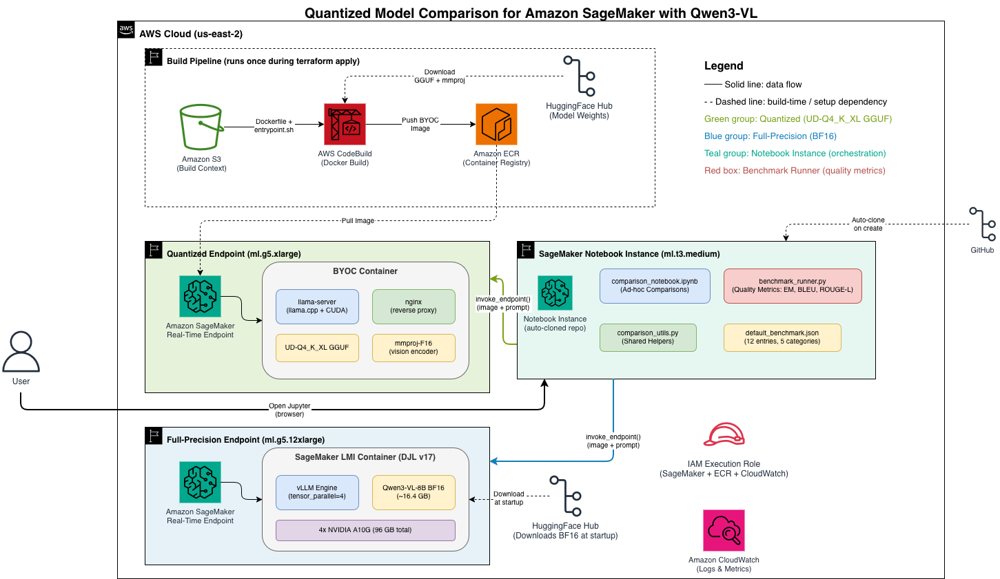

# Quantized Model Comparison for Amazon SageMaker with Qwen3-VL

> **⚠️ Important:** This project is provided as sample code for demonstration and educational purposes only. It is **not intended for production use**.

Side-by-side comparison of [Unsloth's](https://unsloth.ai) dynamically quantized Qwen3-VL-8B-Instruct (4-bit GGUF via llama.cpp) against the full-precision BF16 variant (via vLLM on SageMaker LMI), deployed on Amazon SageMaker real-time endpoints.

This project supplements the blog post: **[Quantization and Deploying Models on AWS](TODO_BLOG_URL_PENDING_PUBLICATION)**.

## What This Does

- Deploys two SageMaker endpoints via Terraform:
  - **Quantized**: Unsloth Q4_K_M GGUF served by llama.cpp in a custom container (`ml.g5.xlarge`, ~$1.41/hr)
  - **Full-Precision**: BF16 served by vLLM via SageMaker LMI (`ml.g5.12xlarge`, ~$7.09/hr)
- Runs a Jupyter notebook that sends identical image prompts to both endpoints
- Compares output quality, latency, throughput, and cost side by side

## Architecture



## Prerequisites

- AWS account with SageMaker access
- [Terraform](https://www.terraform.io/downloads) >= 1.0 — if you're new to Terraform, see the [Get Started tutorial](https://developer.hashicorp.com/terraform/tutorials/aws-get-started)
- AWS CLI configured with credentials — see the [AWS CLI Getting Started guide](https://docs.aws.amazon.com/cli/latest/userguide/getting-started-install.html)
- SageMaker GPU quota in your target region:
  - `ml.g5.xlarge` for endpoint usage (at least 1)
  - `ml.g5.12xlarge` for endpoint usage (at least 1) — this often requires a [quota increase request](https://console.aws.amazon.com/servicequotas/)
- A Jupyter environment to run the notebook (provisioned automatically by Terraform, or bring your own)

## Quick Start

### 1. Deploy Infrastructure

```bash
cd terraform
terraform init
terraform apply
```

This creates:
- An ECR repository and builds the llama.cpp BYOC container via AWS CodeBuild
- IAM roles for SageMaker and CodeBuild
- Two SageMaker real-time endpoints

The first deploy takes ~15-20 minutes (CodeBuild + endpoint startup).

### 2. Run the Notebook

Terraform provisions a SageMaker Notebook Instance with the repo pre-cloned. Get the URL:

```bash
terraform output notebook_instance_url
```

Open the URL in your browser — the comparison notebook, test images, and all dependencies are already there. Just open `comparison_notebook.ipynb` and run the cells.

> **Already have a Jupyter environment?** Add `-var="create_notebook_instance=false"` to skip the Notebook Instance and run the notebook locally or in SageMaker Studio instead. Make sure `comparison_utils.py`, `benchmark_runner.py`, and `default_benchmark.json` are in the same directory as the notebook.

The notebook will:
1. Download test images locally
2. Send each image to both endpoints
3. Display side-by-side model outputs
4. Plot latency and throughput comparisons
5. Show a cost comparison table

### 3. Clean Up

To avoid ongoing charges (~$8.50/hr while both endpoints are running):

```bash
cd terraform
terraform destroy
```

## Benchmarking

The notebook includes an objective quality evaluation framework that measures how quantization affects model output quality using structured benchmarks.

### Built-in Benchmark

The default benchmark dataset (`default_benchmark.json`) contains 12 entries covering:
- **VQA** (Visual Question Answering) — e.g., "What animal is in this image?"
- **OCR** (Text Extraction) — e.g., "What text is visible in this image?"
- **Image Description** — e.g., "Describe this image in one sentence."
- **Scene Description** — e.g., "What city is this likely in?"
- **Object Identification** — e.g., "What is the main subject of this image?"

Each entry is evaluated against both models, and three quality metrics are computed:
- **Exact Match** — case-insensitive string equality between generated and expected answers
- **BLEU** — n-gram precision score (0.0–1.0)
- **ROUGE-L** — longest common subsequence F-measure (0.0–1.0)

### Custom Benchmark Dataset

Provide your own benchmark dataset by setting `BENCHMARK_DATASET_PATH` in the notebook's benchmark configuration cell. Supported formats:

**CSV** (required columns: `image_path`, `prompt`, `expected_answer`; optional: `category`):
```csv
image_path,prompt,expected_answer,category
test_images/cat_snow.jpg,What animal is in this image?,cat,VQA
test_images/hollywood_sign.jpg,What text is visible?,HOLLYWOOD,OCR
```

**JSON** (list of objects with the same keys):
```json
[
  {"image_path": "test_images/cat_snow.jpg", "prompt": "What animal?", "expected_answer": "cat", "category": "VQA"}
]
```

If no custom dataset is provided, the built-in default is used automatically.

### Interpreting the Degradation Report

The benchmark produces a degradation report comparing both models:

| Column | Meaning |
|--------|---------|
| Quantized / Full Precision | Aggregate score for each model (higher is better) |
| Difference | Quantized minus Full Precision (negative means quantized scored lower) |
| Relative Change | Percentage change relative to full precision |
| Assessment | "No degradation" if scores are equal, otherwise shows the direction |

Per-category breakdowns show which task types (VQA, OCR, etc.) are most affected by quantization.

## Running Tests

```bash
pip install -r requirements.txt
python -m pytest tests/ -v
```

The test suite includes unit tests for the benchmark runner, dataset loading, notebook structure validation, and computation functions.

## Cost Estimate

| Endpoint | Instance | Hourly Cost |
|----------|----------|-------------|
| Quantized (Q4_K_M GGUF) | ml.g5.xlarge | ~$1.41/hr |
| Full-Precision (BF16) | ml.g5.12xlarge | ~$7.09/hr |
| **Total** | | **~$8.50/hr** |

## Configuration

Edit `terraform/variables.tf` to change defaults:

| Variable | Default | Description |
|----------|---------|-------------|
| `aws_region` | `us-east-2` | AWS region for all resources |
| `quantized_instance_type` | `ml.g5.xlarge` | Instance for quantized endpoint |
| `full_precision_instance_type` | `ml.g5.12xlarge` | Instance for full-precision endpoint |

## Project Structure

```
├── README.md                      # This file
├── comparison_notebook.ipynb      # Main comparison notebook
├── comparison_utils.py            # Shared data models and helper functions
├── benchmark_runner.py            # Benchmark evaluation framework
├── default_benchmark.json         # Built-in benchmark dataset (12 entries)
├── requirements.txt               # Python dependencies (pinned versions)
├── test_images/                   # Sample images for comparison and benchmarks
├── tests/                         # Test suite (pytest + Hypothesis)
│   ├── test_benchmark_runner.py   # Unit tests for benchmark runner
│   ├── test_load_benchmark_dataset.py  # Tests for dataset loading
│   └── test_notebook_structure.py # Notebook structure validation
├── terraform/
│   ├── main.tf                    # SageMaker endpoints, ECR, CodeBuild, optional Notebook Instance
│   ├── variables.tf               # Configurable variables (region, instance types, notebook)
│   ├── outputs.tf                 # Endpoint names, notebook URL
│   ├── iam.tf                     # IAM roles for SageMaker and CodeBuild
│   ├── Dockerfile                 # BYOC container for llama.cpp
│   ├── serving_script/
│   │   └── entrypoint.sh          # Container entrypoint (llama-server + nginx)
│   └── README.md                  # Terraform-specific instructions
└── LICENSE
```

---

## Background

### What Is Quantization?

Large language models store their parameters as high-precision floating-point numbers (typically BF16 or FP16, using 16 bits per parameter). An 8-billion parameter model at BF16 precision requires ~16 GB of storage and GPU memory. Quantization reduces this by representing parameters with fewer bits — for example, 4-bit quantization shrinks the same model to ~5 GB.

The trade-off is straightforward: smaller models are cheaper and faster to serve, but aggressive compression can degrade output quality. The challenge is finding the right balance.

### Unsloth Dynamic 2.0 Quantization

[Unsloth Dynamic 2.0](https://unsloth.ai/blog/dynamic-4bit) takes a different approach from standard quantization methods. Instead of applying the same bit-width uniformly across all layers, it **selectively quantizes each layer based on its sensitivity to compression**.

How it works:

- **Layer-by-layer analysis**: Unsloth profiles each layer's sensitivity to quantization by measuring activation errors and weight quantization errors. Some layers (particularly early layers and vision projection layers in multimodal models) are much more sensitive than others.
- **Dynamic bit allocation**: Sensitive layers are kept at higher precision (e.g., 16-bit), while less sensitive layers are compressed more aggressively (e.g., 4-bit). The specific combination differs for every model.
- **Custom calibration**: Each model uses a curated calibration dataset of >1.5M tokens to determine the optimal quantization scheme, rather than relying on generic approaches.

The result is a model that's nearly as accurate as the full-precision original, but at a fraction of the size. For example, Unsloth's Dynamic 4-bit quantization of Qwen2-VL-2B correctly describes an image as "a train traveling on tracks," while standard 4-bit quantization of the same model hallucinates "a vibrant and colorful scene of a coastal area."

### GGUF Format

The quantized models in this project use the [GGUF format](https://github.com/ggerganov/ggml/blob/master/docs/gguf.md) (GPT-Generated Unified Format), the standard file format for llama.cpp inference. GGUF files are self-contained — they include the model weights, tokenizer configuration, and metadata in a single file. This makes them easy to deploy: download one file, point llama.cpp at it, and start serving.

### What Is Q4_K_M?

The `Q4_K_M` in the GGUF filename refers to the specific quantization scheme:
- **Q4** — 4-bit quantization (each weight stored in 4 bits instead of 16)
- **K** — uses k-quant method, which groups weights into blocks and stores per-block scaling factors for better accuracy
- **M** — medium size variant (balances quality vs compression; S = small/more compressed, L = large/less compressed)

Q4_K_M is widely considered the sweet spot for 4-bit quantization — it preserves most of the model's quality while achieving ~3x compression over BF16.

### Artifact → Runtime → AWS Service

A key idea from the companion blog: **the output artifact should drive the serving design**.

The quantized model is exported as a GGUF file, which maps naturally to **llama.cpp** as the runtime. llama.cpp is lightweight, runs on a single GPU, and serves GGUF files directly via a chat completions API. On AWS, that maps to a custom container (BYOC) on a small SageMaker endpoint.

The full-precision model stays in safetensor format (BF16), which maps naturally to **vLLM** — a production GPU serving engine built for throughput and batching. On AWS, that maps to the SageMaker Large Model Inference (LMI) container.

This is the pattern: choose the artifact first, then the runtime, then the AWS service.

---

## Production Hardening

This project is sample code. If you adapt it for production, consider these changes:

- **Mirror the base image to ECR**: Pull `ghcr.io/ggml-org/llama.cpp:server-cuda`, push it to your own ECR repository, and pin the Dockerfile `FROM` to the ECR image by SHA256 digest. This eliminates the external dependency on GitHub Container Registry.
- **Pin HuggingFace model revisions**: Add `--revision <commit-sha>` to the `hf download` commands in the Dockerfile and set `OPTION_HF_REVISION` on the LMI container environment. Verify downloaded weights with `sha256sum` to prevent supply-chain substitution.
- **Replace the SageMaker managed policy**: Swap `AmazonSageMakerFullAccess` for a custom policy with only the specific permissions needed for model hosting.
- **Use SSO / IAM Identity Center**: Avoid long-lived AWS access keys on developer workstations. Configure AWS SSO for Terraform and CLI access.
- **Pre-stage model weights in S3**: Instead of downloading from HuggingFace at build/deploy time, store the model artifacts in a private S3 bucket and load from there.
- **Use remote Terraform state**: Configure an S3 backend with DynamoDB locking to avoid storing state files on local workstations.
- **Deploy in a VPC**: Add VPC configuration to the SageMaker endpoints with VPC endpoints for SageMaker, ECR, S3, and KMS.
- **Enable data capture**: If inference payloads need auditing, enable SageMaker data capture on the endpoint configurations.

---

## Security

See [CONTRIBUTING](CONTRIBUTING.md#security-issue-notifications) for more information.

## License

This library is licensed under the MIT-0 License. See the [LICENSE](LICENSE) file.
